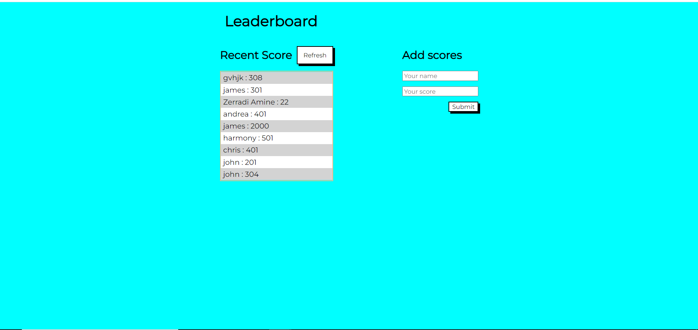

# Leaderboard Website

> This is an educational project to create a website which displays scores submitted by different players. It also allows you to submit your score. All data is preserved thanks to the external [Leaderboard API Service](https://www.notion.so/Leaderboard-API-service-24c0c3c116974ac49488d4eb0267ade3).


## Built With

- [x] Languages: HTML, Sass and JavaScript
- [x] Linters: Lighthouse, Webhint, Stylelint and ESLint
- [x] Module Bundler: Webpack
- [x] Module Bundler Loaders: Style, CSS and Sass
- [x] Module Bundler Plugins: HtmlWebpackPlugin, FaviconWebpackPlugin, MiniCssExtractPlugin and CssMinimizer Plugin
- [x] Code Editor: VS Code

## Website Mockup 📱 💻 🖥️


## Screenshots 📸
Screenshots can be found in the repository.

## Live Demo 🔗

Check the live demo [here](https://christabelle143.github.io/Leaderboard/)👈

## Getting Started

To get a local copy up and running follow these simple steps.

### Prerequisites

- [x] A web browser like Google Chrome.
- [x] A code editor like Visual Studio Code with Git and Node.js.

You can check if Git is installed by running the following command in the terminal.
```
$ git --version
```

Likewise for Node.js and npm for package installation.
```
$ node --version && npm --version
```

### Setup

Clone the repository using the GitHub link provided below.

### Install

In the terminal, go to your file directory and run this command.

```
$ git clone 
```

### Usage

Kindly modify the files as needed.

### Run tests

To check for linters, use the files provided by [Microverse](https://github.com/microverseinc/linters-config). A GitHub action is also set to run during pull request.
```
$ npm install
```

### Deployment

This app is deployed in the GitHub Pages for easy viewing upon merged on the main branch.
Please find the link in the Live Demo section.


## Author

👤 **Mavericks Balitaan** 

- GitHub: [](https://github.com/mavericks-db)

- Twitter: [](https://twitter.com/mavericks_db)

- Facebook: [](https://www.facebook.com/mavericksdb/)

- LinkedIn: [](https://www.linkedin.com/in/mavericks-db/)

- Gmail: [](mailto:balitaanmavericks@gmail.com)

## 🤝 Contributing

Contributions, issues, and feature requests are welcome!

Feel free to check the [issues page](https://github.com/mavericks-db/leaderboard/issues).

## Show your support

Give a ⭐️ if you like this project!

## Acknowledgments

- [Microverse](https://www.microverse.org/)
- Code Reviewers

## 📝 License

This project is [MIT](./MIT.md) licensed.